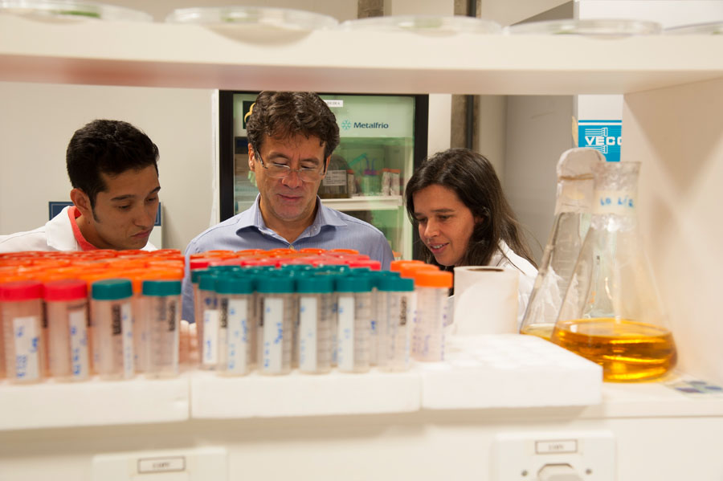

+++
fragment = "content"
#disabled = true
date = "2017-10-05"
weight = 100
#background = ""

title = "Sobre o LGGIPP"
subtitle = "\n"
+++

---

Liderado pelo Prof. Sérgio H. Brommonschenkel, o Laboratório de Genética e Genômica da Interações Planta-Patógeno - LGGIPP tem como objetivo o desenvolvimento de soluções duráveis e sustentáveis de controle de doenças de plantas baseadas no conhecimento das bases moleculares de interações patógeno-planta. O grupo de pesquisa atua com protagonismo no desenvolvimento de soluções duráveis e sustentáveis de controle de doenças de plantas, principalmente a ferrugem da soja (*Phakopsora pachyrhizi*) e mancha-alvo do algodoeiro (*Ramularia gossypii*), baseadas no conhecimento das bases moleculares de interações patógeno-planta, utilizando análises de alta performance seja computacional, edição gênica e genômica comparativa. 

---

